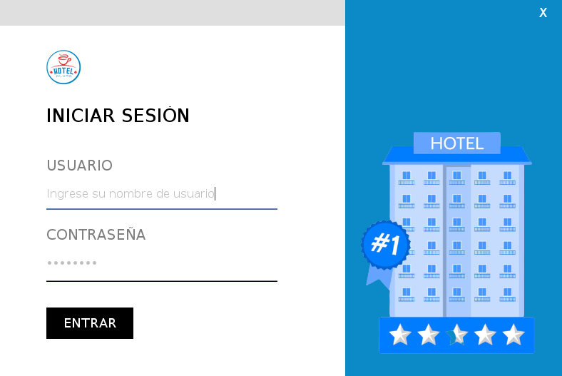

# Hotel Alura

 

### Desafío UNO | Java | Back-end |

     

## Indice

- [Hotel Alura](#hotel-alura)
  - [Índice](#indice)
  - [Descripción del proyecto](#descripcion-del-proyecto)
  - [Estado del proyecto](#estado-del-proyecto)
  - [Características de la aplicación y demostración](#caracteristicas-de-la-aplicacion-y-demostracion)
  - [Acceso al proyecto](#acceso-al-proyecto)
  - [Tecnologías utilizadas](#tecnologias-utilizadas)
  - [Personas Contribuyentes](#personas-contribuyentes)
  - [Autores - Desarrolladores del Proyecto](#autores---desarrolladores-del-proyecto)
  - [Licencia](#licencia)
  - [Conclusión](#conclusion)

---

## Descripcion del proyecto

El proyecto Hotel Alura es una aplicación de gestión de reservas y huéspedes desarrollada en Java Swing con JDK 17. Permite a los usuarios realizar las siguientes acciones:

- **Login de usuario**: Los usuarios pueden iniciar sesión con el usuario y la contraseña `admin`. También tienen la opción de registrarse utilizando una tabla de usuarios que almacena nombres de usuario y contraseñas encriptadas con `Argon2`.

- **Gestión de Reservas**: Los usuarios pueden realizar reservas proporcionando fechas de entrada y salida, y seleccionar entre tres formas de pago: `efectivo`, `tarjeta` de crédito y tarjeta de `débito`.

- **Edición de Reservas**: Los usuarios tienen la capacidad de editar las fechas de las `reservas` existentes.

- **Listado de Huéspedes y Reservas**: El sistema muestra un listado de huéspedes y reservas, permitiendo la búsqueda y eliminación de ambos desde una interfaz de tabla.

## Estado del proyecto

Este proyecto se encuentra en desarrollo activo. Se están realizando mejoras continuas y se agregan nuevas características regularmente.

## Caracteristicas de la aplicacion y demostracion

- `Inicio de sesión` de usuario.
- `Registro de usuarios` con `encriptación` Argon2.
- `Reservas` de habitaciones con fechas de entrada y salida.
- Tres `opciones de pago`: efectivo, tarjeta de crédito y tarjeta de débito.
- `Edición` de fechas de `reserva`.
- `Listado de huéspedes y reservas` con funciones de `búsqueda` y `eliminación`.

---

### Presentacion de la UI

#### Menu principal

  

#### Registro de usuario

  

#### Login | Inicio de sesion

  

#### Menu de usuario

  

#### Sistema de reservas

  

#### Registro de huesped

  

#### Sistema de busqueda - Reservas

  

#### Edicion de reserva

  

#### Sistema de busqueda - Huespedes

  

#### Edicion de huesped

  

## Acceso al proyecto

El proyecto está alojado en [GitHub](https://github.com/facundobazan/challenge-one-alura-hotel-latam).

## Tecnologias utilizadas

El proyecto utiliza las siguientes tecnologías y herramientas:

- `Java Swing`
- `hibernate`
- `Argon2`
- `jakarta`
- `jcalendar`

## Desarrolladores del proyecto

- [Facundo Bazán](https://github.com/facundobazan)

### Proyecto Base

| [ Camila Fernanda Alves](https://github.com/camilafernanda) |  [ Ellen Pimentel]([https://github.com/guilhermeonrails](https://github.com/ellenpimentel)) |  [ Génesys Rondón](https://github.com/genesysaluralatam) |
| :---: | :---: | :---: |

## Licencia

Este proyecto está bajo la `Licencia MIT`

La Licencia MIT es una licencia de código abierto que permite a otros utilizar, modificar y distribuir este software en proyectos privados o comerciales. Los contribuyentes son bienvenidos y se alienta la colaboración. Para obtener más detalles, consulta el archivo [Licencia](LICENSE).

## Conclusion

Hotel Alura es un proyecto en desarrollo que ofrece una solución de gestión de reservas de habitaciones y huéspedes. Está diseñado en Java Swing con JDK 17 y utiliza encriptación Argon2 para garantizar la seguridad de las contraseñas de los usuarios. Siéntete libre de explorar el código fuente en el repositorio de GitHub y contribuir al desarrollo del proyecto. ¡Esperamos que este proyecto te sea útil!